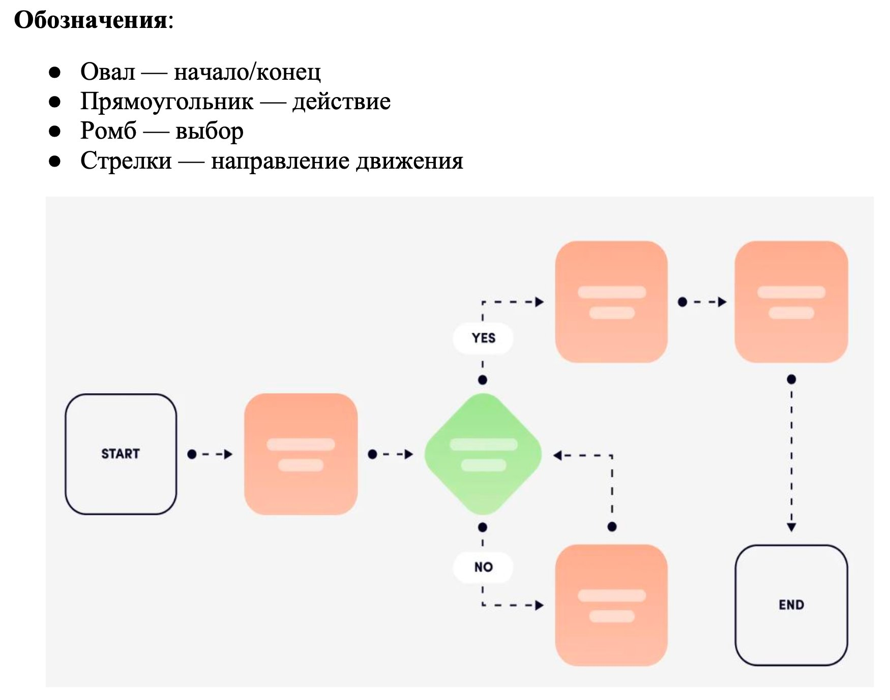

# User Flow — рабочая инструкция команде

## Что это

User Flow — визуальная блок-схема пути пользователя по сайту для достижения конкретной цели. На этапе 2 каждый участник команды отвечает за 2 флоу.

Всего 8 флоу: 4 обязательных (UF-A1..A4) по требованиям МУ и 4 авторских (UF-B1..B4), каждый из которых раскрывает один из 4 экранов будущего прототипа этапа 3.

## Обозначения по МУ

Источник — `Files/МУ_по_заданию_ознакомительной_практики.pdf`, стр. 16, образец оформления:

Сводно:

- **Старт / Конец** — скруглённый прямоугольник, белая заливка, тёмная обводка `#1A2238`.
- **Действие** — скруглённый прямоугольник, персиковая заливка `#F4A896`, без обводки.
- **Выбор** — ромб, мятно-зелёная заливка `#9DD8A8`, без обводки.
- **Подписи ветвлений** — `YES` / `NO` на белой плашке с тёмным текстом.
- **Стрелки** — пунктир, цвет `#1A2238`, точка в начале сегмента.

HEX-значения сняты с растра МУ на глаз. Перед стартом работы в Figma — снять пипеткой с PDF МУ для точности.

**Расхождение МУ.** Текст методички говорит «Прямоугольник — действие», но на образце все действия — скруглённые. Узел «Старт/Конец» в тексте описан как «овал», на образце — скруглённый прямоугольник с обводкой. Следуем визуальному образцу: рисуем со скруглением.

## Чарты-черновики

В папке `charts/` лежат 8 готовых блок-схем (UF_A1..UF_B4.JPG). Это **черновики логики** из Perplexity AI — они показывают узлы, ветвления и порядок шагов.

**Это НЕ финальный визуал.** Чарты в светло-голубой палитре, без формы и цветов МУ. При переносе в Figma:

- Логика и текст узлов — берём из чарта.
- Форма узлов, цвета, стрелки, подписи `YES`/`NO` — строго по образцу МУ выше.

Если в логике чарта что-то спорно или не стыкуется с Site Map — правим, не копируем вслепую.

## Что сдаём в отчёт

На каждый флоу:

1. Схема в Figma по обозначениям МУ.
2. Краткое описание сценария (пользователь, цель, шаги, ветвления).
3. Описание раскрываемой структуры экрана — только для UF-B1..B4 (это обоснование выбора экрана для прототипа этапа 3).

В отчёт идёт растровый экспорт схемы (PNG, 2x), вставляется как рисунок со сквозной нумерацией. Подпись: «Рисунок N — User Flow: [название сценария]». В тексте обязательная ссылка `(рисунок N)` (требование защиты 1 этапа).

## Распределение

8 флоу / 4 человека = 2 на участника. Конкретное распределение согласовывается на ближайшей встрече команды.

При распределении логично учитывать зоны ответственности по страницам (см. `Страницы.md`), чтобы участник делал флоу для тех экранов, которые он же описывает в проектном разделе отчёта.

---

## Группа A — обязательные сценарии

### UF-A1 — Просмотр работ без регистрации

**Пользователь:** Гость (абитуриент, работодатель, случайный посетитель).
**Цель:** Ознакомиться с работами студентов без создания аккаунта.
**Раскрываемые страницы:** Главная, Каталог работ, Страница проекта.

**Шаги:**

1. Гость открывает сайт → **Главная страница**.
2. В блоке «Избранные работы» нажимает «Смотреть все работы» → **Каталог работ**.
3. Ветвление: применить фильтр?
   - Да → панель фильтров (курс / дисциплина / тип) → каталог обновляется.
   - Нет → просмотр общей ленты.
4. Клик на карточку → **Страница проекта**.
5. Просмотр галереи, описания, тегов, имени автора.
6. Ветвление: перейти на профиль автора?
   - Да → клик на имя → **Профиль студента** (режим гостя).
   - Нет → возврат в каталог или продолжение просмотра.
7. Конец: ознакомление состоялось, ненавязчивый CTA на регистрацию.

---

### UF-A2 — Поиск конкретной работы

**Пользователь:** Гость или авторизованный (преподаватель, работодатель).
**Цель:** Найти конкретную работу или работы по критерию через поиск.
**Раскрываемые страницы:** Главная, Результаты поиска, Страница проекта.

**Шаги:**

1. **Главная страница** → ввод запроса в строку поиска (например: «брендинг», «3D», «типографика»).
2. Enter / клик «Поиск» → **Страница результатов поиска**.
3. Ветвление: найдены ли релевантные результаты?
   - Да → просмотр результатов.
   - Нет → «Ничего не найдено» → пользователь уточняет запрос (возврат к шагу 1).
4. Клик на карточку → **Страница проекта**.
5. Ветвление: нужны работы той же дисциплины?
   - Да → клик на тег дисциплины → новый поиск по тегу (возврат к шагу 3).
   - Нет → конец.

**Покрытие поиска:** название работы, теги, имя студента, дисциплина.

---

### UF-A3 — Регистрация студента

**Пользователь:** Студент кафедры, регистрирующийся впервые.
**Цель:** Создать аккаунт и получить доступ к ЛК для публикации работ.
**Раскрываемые страницы:** Главная, Авторизация / Регистрация, ЛК студента.

**Шаги:**

1. **Главная** → «Войти / Зарегистрироваться» → **Страница авторизации**.
2. Выбор вкладки «Регистрация».
3. Заполнение формы: имя, фамилия, email (университетский), пароль, курс, направление.
4. Клик «Создать аккаунт».
5. Ветвление: форма корректна?
   - Нет → подсветка ошибок → возврат к шагу 3.
   - Да → система создаёт аккаунт.
6. Перенаправление в **ЛК студента → Мой профиль**.
7. Ветвление: заполнить профиль сейчас?
   - Да → фото, bio, навыки → сохранение.
   - Нет → переход на главную или в каталог.
8. Конец: аккаунт создан, профиль доступен для редактирования.

---

### UF-A4 — Добавление работы студентом

**Пользователь:** Авторизованный студент, публикующий новую работу.
**Цель:** Загрузить и опубликовать проект в портфолио.
**Раскрываемые страницы:** ЛК студента, Форма добавления работы, Страница проекта.

**Шаги:**

1. **ЛК студента → Мои работы** → клик «Добавить работу» → **Форма добавления работы**.
2. Заполнение полей: название, описание, дисциплина (выпадающий список), курс / год, теги, загрузка изображений (drag & drop).
3. Клик «Опубликовать».
4. Ветвление: обязательные поля заполнены, изображение загружено?
   - Нет → подсветка ошибок → возврат к шагу 2.
   - Да → система публикует работу.
5. Перенаправление на **Страницу проекта** (публичный вид).
6. Ветвление: нужны правки?
   - Да → «Редактировать» → возврат к форме (шаг 2).
   - Нет → конец, работа опубликована.

---

## Группа B — авторские сценарии (раскрытие экранов прототипа)

Каждый флоу группы B спроектирован так, чтобы раскрыть структуру одного из 4 экранов, которые пойдут в прототип этапа 3. Это даёт обоснование выбора экранов до начала прототипирования.

### UF-B1 — Знакомство с платформой через Главную

**Раскрываемый экран прототипа:** Главная страница.
**Пользователь:** Абитуриент (школьник или студент колледжа).
**Цель:** Составить впечатление о кафедре и уровне работ, понять направление обучения.

**Шаги:**

1. Переход по ссылке из соцсети / поисковика → **Главная страница**.
2. Видит блоки: Hero (название + описание платформы), «Избранные работы», «О кафедре» (тизер).
3. Ветвление: что привлекает внимание?
   - Работы → клик на карточку из витрины → **Страница проекта**.
   - О кафедре → «Подробнее» → **О кафедре**.
   - Все работы → «Смотреть все» → **Каталог работ**.
4. Ветка «О кафедре»: чтение информации о направлении и преподавателях → «Посмотреть работы студентов» → **Каталог работ** → **Страница проекта**.
5. Ветка «Работы из витрины»: изучение страницы проекта → возврат на главную через логотип → просмотр других работ.
6. Конец: общее представление получено, CTA «Узнать о поступлении».

**Структура Главной, раскрытая сценарием:**

- Шапка с навигацией и поиском.
- Hero-секция (название + описание платформы).
- Витрина избранных работ (6–9 карточек).
- Тизер «О кафедре» с кнопкой перехода.
- Футер с контактами и навигацией.

---

### UF-B2 — Изучение работы и автора через Страницу проекта

**Раскрываемый экран прототипа:** Страница проекта.
**Пользователь:** Работодатель (представитель студии или агентства).
**Цель:** Оценить конкретный проект и понять уровень и специализацию автора.

**Шаги:**

1. **Каталог работ** → фильтр по специализации (например, «UX/UI», «Брендинг»).
2. Клик на карточку → **Страница проекта**.
3. Изучение страницы: галерея, блок «О проекте», мета-данные (дисциплина, курс, год, инструменты), теги, блок «Автор».
4. Ветвление: интересен ли автор?
   - Да → клик на блок «Автор» → **Профиль студента** (режим гостя).
   - Нет → прокрутка до блока «Похожие работы».
5. В блоке «Похожие работы» — клик → новая **Страница проекта**.
6. Ветвление: связаться со студентом?
   - Да → «Связаться» → форма / контактный email.
   - Нет → продолжение просмотра.
7. Конец: проект оценён, есть переход в профиль или контакт.

**Структура Страницы проекта, раскрытая сценарием:**

- Галерея изображений (full-width).
- Название + описание / концепция.
- Мета-данные: дисциплина, курс, год, инструменты.
- Теги (кликабельные → фильтр в каталоге).
- Блок «Автор» (карточка-ссылка).
- Блок «Похожие работы» (рекомендации).
- Кнопка «Связаться».

---

### UF-B3 — Просмотр портфолио студента через Профиль

**Раскрываемый экран прототипа:** Профиль студента.
**Пользователь:** Авторизованный студент (старшекурсник), ищущий референсы.
**Цель:** Изучить портфолио конкретного студента, найти его лучшие работы.

**Шаги:**

1. **Каталог профилей** → клик на карточку студента → **Профиль студента**.
2. Изучение профиля: шапка (фото, имя, курс, направление, bio), теги навыков, сетка работ.
3. Ветвление: что интересует?
   - Конкретная работа → клик на карточку → **Страница проекта** → возврат через хлебные крошки.
   - Все работы дисциплины → клик на тег → **Каталог работ** с фильтром.
4. Ветвление: сохранить профиль?
   - Авторизован → «Добавить в закреплённые».
   - Не авторизован → «Копировать ссылку».
5. Конец: портфолио изучено, профиль сохранён или скопирован.

**Структура Профиля студента, раскрытая сценарием:**

- Шапка: аватар, имя, курс, направление, краткое bio.
- Теги навыков и инструментов.
- Сетка работ (с сортировкой: новые / популярные).
- Кнопка «Сохранить» / «Добавить в закреплённые» (для авторизованных).
- Хлебные крошки.

Профиль должен работать в двух режимах: публичная страница (для гостей) и «своя» страница (с кнопками редактирования для владельца).

---

### UF-B4 — Работа с подборками

**Раскрываемый экран прототипа:** Страница подборки.
**Пользователь:** Авторизованный студент, собирающий референсы и вдохновение.
**Цель:** Найти тематическую подборку, изучить её, сохранить понравившиеся работы.

**Шаги:**

1. **Главная** → блок «Подборки» → клик на карточку подборки → **Страница подборки**.
2. Изучение: название, описание, автор подборки (преподаватель / система), сетка карточек работ.
3. Клик на карточку → **Страница проекта**.
4. Ветвление: нравится работа?
   - Да → лайк / добавление в коллекцию → возврат на страницу подборки.
   - Нет → возврат на страницу подборки.
5. Ветвление: просмотрены все работы?
   - Нет → возврат к шагу 3.
   - Да → переход к шагу 6.
6. Ветвление: найти похожие подборки?
   - Да → клик на тег подборки → список похожих.
   - Нет → конец.

**Структура Страницы подборки, раскрытая сценарием:**

- Заголовок + описание подборки.
- Карточка-ссылка на автора / составителя.
- Теги подборки (тематика, дисциплина, год).
- Сетка карточек работ (с лайком прямо из сетки).
- Кнопка «Добавить всё в избранное».
- Блок «Похожие подборки».

**Замечание для команды.** В текущем `Страницы.md` отдельной «Страницы подборки» нет — есть «Страница 6. Подборки работ» как список. UF-B4 предполагает детальную страницу одной подборки. Перед прототипированием уточнить на встрече: это новая страница (тогда дополнить Site Map) или детальный вид страницы 6.

---

## Сводная таблица

| # | Название | Группа | Пользователь | Точка входа | Раскрываемый экран прототипа |
|---|---|---|---|---|---|
| UF-A1 | Просмотр работ без регистрации | Обязательный | Гость | Главная | Каталог работ |
| UF-A2 | Поиск конкретной работы | Обязательный | Гость / авторизованный | Главная | Результаты поиска |
| UF-A3 | Регистрация студента | Обязательный | Студент (новый) | Главная | Регистрация / ЛК |
| UF-A4 | Добавление работы | Обязательный | Студент (авторизованный) | ЛК | Форма загрузки |
| UF-B1 | Знакомство через Главную | Авторский | Абитуриент | Главная | **Главная страница** |
| UF-B2 | Изучение работы и автора | Авторский | Работодатель | Каталог работ | **Страница проекта** |
| UF-B3 | Просмотр портфолио студента | Авторский | Студент (авторизованный) | Каталог профилей | **Профиль студента** |
| UF-B4 | Работа с подборками | Авторский | Студент (авторизованный) | Главная | **Страница подборки** |

---

## Чек-лист переноса в Figma

1. Открыть свой чарт из `charts/`.
2. Создать фрейм в Figma / FigJam с обозначениями по МУ (см. блок «Обозначения» выше).
3. Перенести узлы и связи 1-в-1 по логике чарта.
4. Применить цвета и формы по МУ — не по чарту.
5. Подписи ветвлений — `YES` / `NO` на белой плашке.
6. Стрелки — пунктир `#1A2238` с точкой в начале сегмента.
7. Экспорт в PNG 2x для отчёта.
8. Положить экспортированный PNG в `Этап-2/Images/` со сквозной нумерацией рисунка.
